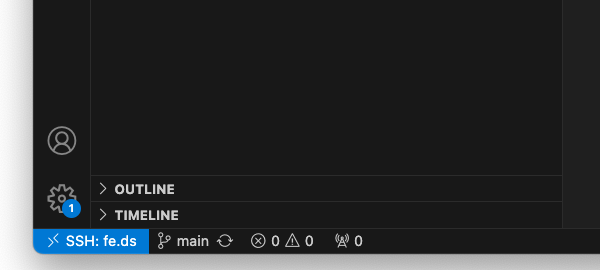

### Step 1: Slurm Review

The commands to remember are:
- `sinfo` for information about the cluster
- `squeue` for information about currently running or queued jobs
- `srun` to run a job interactively
- `sbatch` to submit a job to the queue (we'll use submitit for this)
- `scancel` to cancel a job. Use `scancel JOB_NUMBER`


### Important Slurm commands and concepts

1. Run `sinfo` to see what nodes are on the cluster. The first column `PARTITION` will list a `dev` and `general` partition and maybe more. Partitions are just different sets of nodes that different groups of users may have different access to. `TIMELIMIT` is the longest job you can run on a particular partition and `NODES` is the number of nodes in the partition. 
2. Run `squeue` to see the state of the queue. If any jobs are currently running, it will show its JOBID, the PARTITION it is on, what USER owns it, the state of the job (ST column. R = Running, PD = Pending, CG = Completing), and the NODELIST of nodes it is using.
3. To submit a job request, we'll use `srun`. `srun` is for interactive jobs (`sinteractive` is an alias for something similar to this) that allow us to interact with our code while it is attached to the compute node. `srun` has many configurable options, here are the ones we'll use most: 
    - `-t` or time. The duration of the allocation. can be of the format `# of minutes:# of seconds` so `-t 240:00` would request a node for 240 minutes. 
    - `--mem` or memory. The amount of memory/RAM you would like. By default a number is read in KBs, but by ending with G it is read in GBs. So `--mem 1000` would request 1000 KBs and `--mem 16G` would request 16 gigabytes. 
    - `-p` or partition. Use `general` for interactive jobs. 
    - `--gres` or 'generic resources' is what we use to request gpus. `--gres=gpu:1` will request a single gpu. 
    - `--pty` is added to attach to the process in a pseudoterminal. 
4. Run `srun -p general -t 5:00 --mem 1G --pty /bin/bash` to request a compute node. 
5. Now your terminal is connected to the compute node. Notice that `ls` and `pwd` give the same results as before. This is because the compute nodes and login nodes use the same filesystems. If you edit a file in one, the second it is saved it will be visible in the other. Type `exit` to end your job and return to a login node. You can also cancel a job by running `scancel JOB_ID`. 


## Part III: Slurm and cluster basics

You can now successfully and easily connect to the cluster in your terminal! Congratulations, this is not a trivial task. Lets run through some cluster and Slurm basics. 

### Step 1: Connecting to the Cluster

Before starting this, make sure that you are familiar with using a Unix command line. You can find some information [here](./command-line.md).

1. Connect to the cluster using `ssh fe.ds`.
    * If this works you should see a change in your command prompt. If there are any notifications or messages from `ssh` this probably means that you did not connect.
2. Verify that you are in your _home_ directory using the `pwd` command. Running this command should return `/home/USERNAME` where `USERNAME` is your CNET ID.
3. Understand where data should be place:
    * Home directories are limited to 20 GB of storage. 
    * Home directories are only accessible by you, so they should be not be used for any data that needs to be shared with anyone else
    * The directory `/net/projects` shows _shared_ project directories. These are limited access and you need to contact techstaff if you do not have access to a directory required for a project. Unix user groups are used to manage access. This is the primary location where data should be placed.
    * The directory `/net/scratch` and `/net/scratch2` are open areas where anyone can put anything. Note that this is _ephemeral_. Any data put here may be deleted at any time. 
    * All of the `/net` directories are network storage drives and are available on any node in the cluster.
4. Understand the language of the cluster:
    * **Cluster:** A collection of connected computers which are set up in to share resources (compute, hard drive and memory) so they behave as a single system.
    * **Nodes:** A node is a single computer within the cluster.
    * * **Login Nodes:** A node designed to manage logins, no computing jobs should be run on them. In the DSI cluster these nodes begin with `fe`.
    * **Compute Nodes:** A node which was created for high-performance computing. They have powerful GPUs, CPUs and lots of memory. On the DSI cluster there are multiple designations, such as `g, h, i, j, k, l` and `m`. Nodes with matching prefixes have similar hardware.

### Step 2: Using Slurm

When you want to run an intensive job, use a compute node. These are powerful computers with GPUs, powerful CPUs, and/or lots of memory. In order to fairly share them among all users, Slurm manages a queue system. Users submit requests of what resources they need and when they become available, Slurm grants access. 

**Important:** Before using Slurm on the cluster, please read over the documentation [here](./slurm_commands.md).

Additional reference information about UChicago's Slurm set up can be found at the [UChicago CS Slurm How To Page](https://howto.cs.uchicago.edu/slurm?s[]=slurm).

## Part IV: Clone your repository on the cluster

1. Note that if you have a private git repository you will need to [create an ssh key](#part-ii-set-up-ssh) on the cluster and add those keys to github. Since you are connecting from the environment of the cluster to github you will need to establish your cluster account with github.
2. Connect to the login node. `ssh fe.ds`
3. Verify your current working directory by typing `pwd` and checking to make sure it says `\home\CNET ID`. If this is not your current working directory type in `cd ` to return to your home directory.
4. Go to the repository github page, click the dropdown on the green button that says 'Code', select 'SSH' and copy the value.
1. Type in `git clone COPIED_VALUE` to clone the repo to your home directory. Verify that there were no errors printed and that the repo was properly cloned.

## Part V: Set up VS Code

The instructions below provide specific instructions for setting up [VS Code](https://code.visualstudio.com/). Before preceding, please make sure that it is installed.

### Step 1: Connect to the Login Node with VS Code

Traditionally, one would `ssh` in a terminal and be restricted to command-line text editors like Vim. We can use the extension, `Remote - SSH` allows us to act like we are developing on our local machine as normal for the most part and has less of a learning curve. Information on the extension can be found [here](https://marketplace.visualstudio.com/items?itemName=ms-vscode-remote.remote-ssh).

1. Install `Remote - SSH`. Click 'Extensions' on the menu at the left side of VS Code (its icon is four squares with the top right one pulled away). Search for and install `Remote - SSH`. 

2. We want to allow common extensions to be used on the cluster. Open the command palette (ctrl+shift+p / command+shift+p / View -> Command Palette...) and search for `Open User Settings (JSON)`. If it is empty, paste the following:
3. 
```
{
    "remote.SSH.defaultExtensions": [
        "ms-toolsai.jupyter",
        "ms-toolsai.jupyter-renderers",
        "ms-python.python",
        "ms-python.vscode-pylance"
    ]
}
```

Otherwise, make sure to add a comma to the end of the current last item and add the following before the `}`:

```
    "remote.SSH.defaultExtensions": [
        "ms-toolsai.jupyter",
        "ms-toolsai.jupyter-renderers",
        "ms-python.python",
        "ms-python.vscode-pylance"
    ]
```

1. Follow the instructions [here](https://code.visualstudio.com/docs/remote/ssh#_connect-to-a-remote-host) to set up with the following modifications: 
    - In "Connect to a remote host", try `Remote-SSH: Connect to Host...` and you should see `fe.ds` as an option. Select it. Otherwise, you can try typing in `fe.ds`.
    - (If you are asked, though sometimes this will be detected by VS Code) The type of server is Linux.
2. The (usually green) box at the bottom left of your VS Code window should now say `SSH: fe.ds` to signify you are using the SSH extension and connected to the host `fe.ds` as in the image here:

<div align="center">
  
</div>

3. Assuming you have correctly [cloned the repo on the cluster](#part-iv-clone-your-repository-on-the-cluster) you can you click `File` then `Open Folder` and select your repository folder. 
4. Close the window. Now if you open a new VS Code window and select from recent, the one called `REPOSITORY_NAME [SSH: fe.ds] will take you right to the login node of the cluster with your previous configuration. 

### Step 2: Connect to a Compute Node with VS Code

1. Open a terminal / command prompt. Connect to the cluster using `ssh fe.ds`.
2. You should now be connected to the cluster in a **login** node, which is fine for small tasks and coding. To get access to a powerful compute node, you must request access through Slurm. Request an interactive session with a command like: `srun -p general --gres=gpu:1 --pty --mem 1000 -t 90:00 /bin/bash`. Once you have been your request has been granted, your command prompt will change to something like `USERNAME@hostname` where hostname is probably like `g004`.
3. Now your terminal is connected to a compute node. (NOTE: If you did this in a terminal in VS code, just that terminal will connect to a compute node. The rest of VS Code functionality will be run on the login node still. To connect VS code features like python debug and notebook editing to the compute node follow along).
4. Back in VS Code, open the command palette (ctrl+shift+p / command+shift+p / View -> Command Palette...), search for `Remote-SSH: Connect to Host...`. Select it and type in as your host `HOSTNAME.ds` replacing the `HOSTNAME` with the hostname from above. 
4. Your VS Code should now be connected to the compute node. To verify the  You'll have to open the repository folder (see below instructions for cloning). But now you can take advantage of the computational power from the node and the nice features of VS Code (using notebooks, python debugging, etc.)


## Part VI: Install Conda for Environment Management

1. Connect to cluster
2. In a terminal on the cluster:

```bash
wget https://repo.anaconda.com/miniconda/Miniconda3-latest-Linux-x86_64.sh -O ~/miniconda.sh
bash ~/miniconda.sh
```
You can accept the defaults. Make sure you select yes when it asks to run conda init. This will ensure conda is activated by default. re-open and close your terminal.

3. Create a new environment
```bash
conda create --name PROJECT_NAME python=3.11
conda activate PROJECT_NAME
pip install -r requirements.txt
```
Where `PROJECT_NAME` is the name of the project you are working on. Now when you log into ai cluster, just make sure you run `conda activate PROJECT_NAME`.

4. Ensure VS Code uses the correct python environment. When a python file is open and selected, click the Python version number on the bottom right and select the interpreter for PROJECT_NAME. If it is not listed, the path is: `/home/USERNAME/miniconda3/envs/PROJECT_NAME/bin/python` where `USERNAME` is your CNET ID. 

5. Ensure VS Code uses the correct kernel for Jupyter notebooks. First, install `ipykernel` in the `PROJECT_NAME` environment:
```bash
conda install -n PROJECT_NAME ipykernel --update-deps --force-reinstall
```
With a Jupyter notebook open, click the Python version number in the upper right and select the kernel for `PROJECT_NAME`. You may need to refresh the list of available kernels using the icon in the upper right of the menu.

6. You should now be at a point where you can easily connect to the cluster with VS Code, use jupyter notebooks, and attach to compute nodes for more intensive jobs. This is enough for a lot of tasks, but if you become bothered by long running jobs crashing due to internet connection outages or running out of time on the compute node, please continue to using submitit. 

## Common Errors

Error:  `srun: error: Unable to allocate resources: Invalid account or account/partition combination specified`
<br>Cause: You do not have permission to use the partition you requested from. 
<br>Solution: Most likely you need to email techstaff@cs.uchicago.edu requesting access to compute nodes. Otherwise check that you are requesting the correct partition (currently there is only `dev` and `general`. The default if unspecified is the `dev` partition).

Error: `CUDA out of memory`
<br>Cause: The GPU you were using ran out of RAM.
<br>Solution: Could be difficult to solve completely, but there are few things that usually work:
 - Easy: Simple refactoring. Use less GPU by reducing batch sizes, for example. 
 - Medium: Try using another GPU with more memory. To see GPU's available, run `sinfo -o %G`. You can look up the models online. You can request a specific GPU with the `--gres=gpu:GPU_NAME:1` flag where `GPU_NAME` is the type of gpu (like `a40`)
 - Hard: Major refactoring of your code to use less memory.

Error: `Killed` or `Out of Memory` on compute node
<br>Cause: Most likely, you ran out of CPU memory
<br>Solution: Request more memory! Use the `--mem` flag on `srun`

Error: `Disk quota exceeded`
<br>Symptom: VS code fails to connect to login node
<br>Cause: Each home directory has a quota of disk storage space (~50 GB) and you are above it.
<br>Solution: You need to move or delete some files. If you are working on a project with a `/net/projects/` directory, move any data files or checkpoints into that directory (and update your code accordingly!). To check you disk usage, run `du -sh ~`

Error: `git@github.com: Permission denied (publickey). fatal: Could not read from remote repository.`
<br>Cause: GitHub can not access a private key that matches the public key stored on GitHub.
<br>Solution: If you are on the cluster, make sure that you are forwarding your ssh agent. `ssh-add -l` should return the appropriate key. If no identities are found, your ssh-agent has no identities or is not being forwarded. If `ssh-add -l` locally also returns no identities, you must run `ssh-add PATH_TO_KEY` as specified in Part II, [Step 2](#step-2-create--manage-ssh-keys). If the correct identity is found locally, make sure your ssh config matches the one in this document. Finally make sure you have added the appropriate public key to your GitHub account.

## Troubleshooting Tests

Whenever an error comes up, think about all the potential points of failure. Then try to isolate each and see if they work on their own. For example if you are trying to connect to a compute node with VS code using the steps in these instructions, potential points of failure are: VS Code `Remote - SSH` extension, VS Code, your internet connection, ssh config file, ssh keys, slurm, the cluster. Below find some methods to check if different components are working correctly.

Test: run `ssh fe.ds` locally through the command line:
<br>Expected Result: successful connection to login node.

Test: run `ssh -v fe.ds` locally for verbose output (add up to 3 v's for more verbosity). 
<br>Expected Result: Close to the start, you should see something like: 
```
debug1: Reading configuration data /home/USERNAME/.ssh/config
debug1: /home/USERNAME/.ssh/config line 20: Applying options for fe.ds*
debug1: /home/USERNAME/.ssh/config line 26: Skipping Host block because of negated match for fe.ds
```
where `USERNAME` is your username on your computer. Check that the path after `Reading configuration data` is to the config file you expect and that the right Host blocks are being used. Further down you should see something like: 
```
debug1: Authentications that can continue: publickey,password
debug1: Next authentication method: publickey
debug1: Offering public key: /home/USERNAME/.ssh/id_ed25519 ED25519 SHA256:asdkfh298r9283hkdsjfn23rhdf9284 explicit agent
debug1: Server accepts key: /home/USERNAME/.ssh/id_ed25519 ED25519 SHA256:a;sldfkj2oiefjowihoweflkdfjslfkjksld0923 explicit agent
debug1: Authentication succeeded (publickey).
```

Test: run `ssh-add -l` locally
<br>Expected Result: You should see something like `256 SHA256:<a bunch of characters> USERNAME@HOSTNAME (KEY_TYPE)`. If you see `The agent has no identities`, you must `ssh-add PATH_TO_KEY`.

Test: run `ssh-add -l` on a login node
<br>Expected Result: You should see something like `256 SHA256:<a bunch of characters> USERNAME@HOSTNAME (KEY_TYPE)`. If you see `The agent has no identities`, you must `ssh-add PATH_TO_KEY`.

Test: run `ssh git@github.com` locally and on a login node to test GitHub ssh keys
<br>Expected Result: `Hi GITHUB_USERNAME! You've successfully authenticated, but GitHub does not provide shell access.`

Test: request compute node and `ssh COMPUTE_NODE.ds` where `COMPUTE_NODE` is the node name (like `g004`)
<br>Expected Result: connection to the compute node
